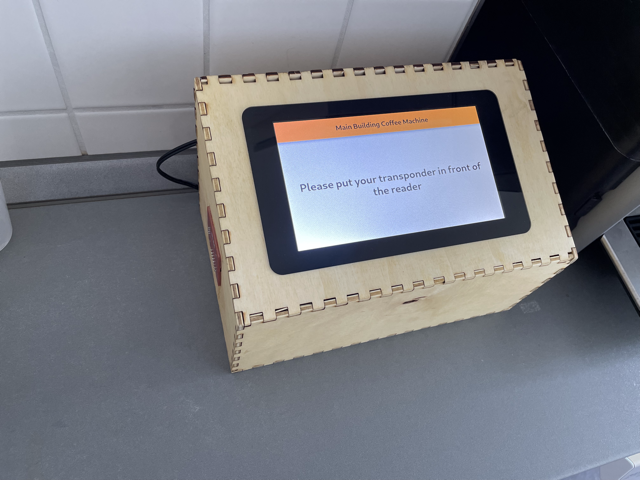
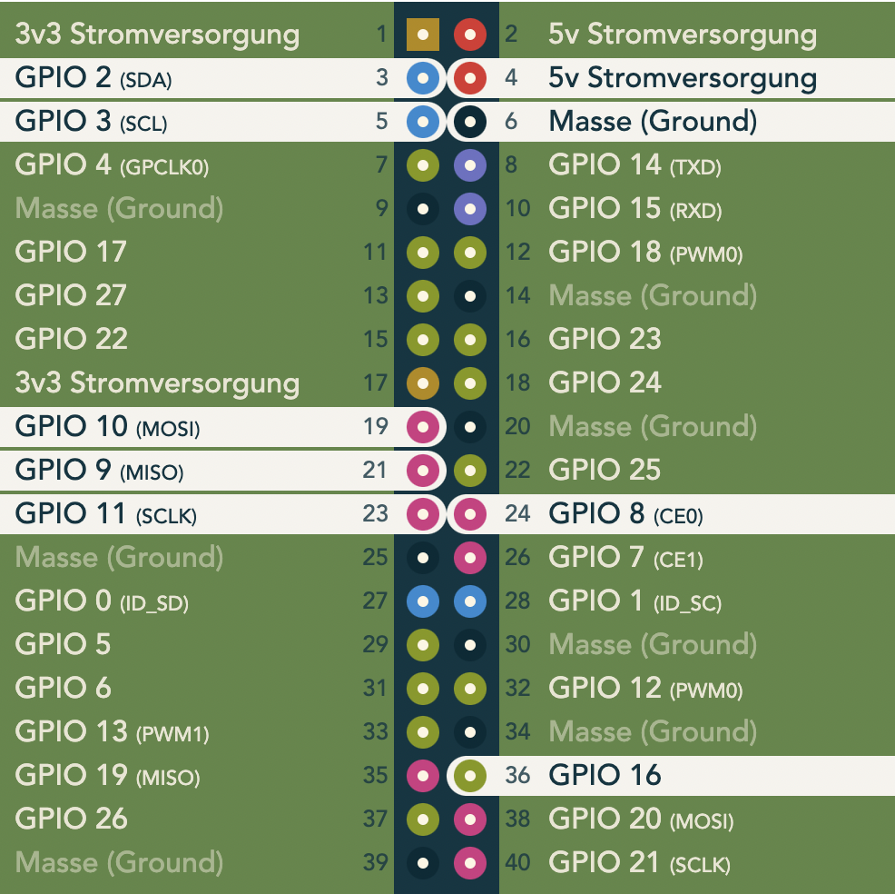

# The Raspberry Pi Terminal Interface

## The finished Terminal with 3D cutted case and RFID reader



# Setting up the Raspberry Pi

## Physical Setup - Wiring

We have to wire up the PN532 NFC Module. Depending on the protocol used we need to wire it up for either SPI or I2C. **I would always recommend to wire up for both protocols!**

- Alwayse needed are the three wires for `VCC`, `GND` and `IRQ` (here `GPIO16`)
- `I2C` needs the `SDA` and the `SCL` wires
- `SPI` needs `MOSI`, `MISO`, `SCLK/SCK`, `CEO/SS`

Just connect the corresponding wires from the PN532 with the Raspberry Pi (no fancy cross wiring just `SDA` -> `SDA`, `SCL` -> `SCL`, `MOSI` -> `MOSI`, ...) according to the following picture:



- **NOTE: the bottom of this picture is where the USB-Ports of the Pi are and the right side is on the edge of the Pi!**

## WiFi
### 1st Option: Corporate wifi setup for `eduroam` (802.1X Standard)

1. First setup the `wpa_supplicant.conf` which is located in `/etc/wpa_supplicant` (full path is `/etc/wpa_supplicant/wpa_supplicant.conf`)<br>
    Past the following content into the file:
    ```
    network={
        ssid="eduroam"
        password="[PLAIN-TEXT-PASSWORD-UNI-POTSDAM]"
        identity="[SHORT-VERSION-USERNAME(UNI-POTSDAM-LOGIN)]@uni-potsdam.de"
        anonymous_identity="eduroam@uni-potsdam.de"
        key_mgmt=WPA-EAP
        eap=PEAP
        phase2="auth=MSCHAPV2"
    }
    ```
    **Replace the [...] with your Username and Password!**

2. Reboot the pi

### 2nd Option: PSK WiFi Setup (e. g. HPI Foyer Wifi)

1. You have to do this as actual root **(sudo won't work here!)**. Become sudo by entering:
  `sudo -i`

2. Configure the wifi with:
  `wpa_passphrase "WLAN-NAME" "WLAN-PASSWORT" >> /etc/wpa_supplicant/wpa_supplicant.conf`

3. Exit the root user:
  `exit`

4. Reboot: `sudo reboot`

### Troubleshooting

1. Sometimes you may also have to edit `/etc/network/interfaces` and add the following lines:
    ```bash
    allow-hotplug wlan0
    iface wlan0 inet manual
        wpa-conf /etc/wpa_supplicant/wpa_supplicant.conf
    iface wlan0 inet dhcp
    ```
2.  - First kill all the `wpa_supplicant` services and bring down all the ethernet devices with the following commands:
        ```bash
        ifdown wlan0
        ifdown wlan0
        killall wpa_supplicant
        ```
    - You can now debug the newly made configuraiton with `sudo wpa_supplicant -i wlan0 -c /etc/wpa_supplicant/wpa_supplicant.conf`. (Optionally you can add -B for deamon mode or -d for debug infos (-dd even more debug infos))
3. Extra infos on this [website](https://inrg.soe.ucsc.edu/howto-connect-raspberry-to-eduroam/)


# Setting up `flutter-pi`

See the [README of flutter-pi](https://github.com/ardera/flutter-pi).
After you have built, simply place the built files in the corresponding folder in the home directory of the pi user on the pi.

Keep in mind that you may need to update both the dependencies of this project as well as the flutter-pi installation on the pi.fl

# Enabling app start after boot up

## Creating the `systemd` entry

1. Create a new file in `/etc/systemd/system` called `fsr-terminal.service` with `sudo touch /etc/systemd/system/fsr-terminal.service`

2. Past in the following content (with `sudo vim /etc/systemd/system/fsr-terminal.service`):

    ```apache
    [Unit]
    Description=The service starting and controlling the FSR Terminal Flutter App
    After=multi-user.target

    # Getting a little fancy with the restart options here
    # The next 3 options are tightly connected to each other
    # Give up restarting and exec StartLimitAction - if it fails 15 times (=StartLimitBurst) within 300 (=StartLimitIntervalSec) seconds
    StartLimitBurst=15
    StartLimitIntervalSec=300
    StartLimitAction=reboot-force

    [Service]
    User=pi
    # Sometimes the flutter-pi path must be given in absolute form
    ExecStart=/home/pi/FsrTerminal/assets/StartScript.sh
    ExecStop=/usr/bin/killall flutter-pi

    # Always try to restart
    Restart=always
    # Retry restart after 10s
    RestartSec=10

    # Useful during debugging; remove it once the service is working
    #StandardOutput=console

    [Install]
    WantedBy=multi-user.target
    ```

3. Reload the service-files though the new service will be found `sudo systemctl daemon-reload`

4. Enable the service by executing `sudo systemctl enable fsr-terminal`

5. Make the `StartScript.sh` executable with: `sudo chmod 755 ~/FsrTerminal/assets/StartScript.sh`

6. When starting the service with `sudo systemctl start fsr-terminal` the app should start as normal otherwise see the `Troubleshooting` section below

7. After a restart the system should automatically open the FSR Terminal

## Troubleshooting

- Check the output of `systemctl status fsr-terminal`

- Check the outputs of `journalctl -u fsr-terminal`

- Check what happens when you execute the command executed by the start up service - look in `/etc/systemd/system/fsr-terminal.service` for `ExecStart=...`

- Make sure the `~/FsrTerminal` got the `755` permission with `sudo chmod 755 ~/FsrTerminal`

- Sometimes you also have to change the `ExecStart` of the `fsr-terminal.service` file directive so that you use an absolute path for `flutter-pi`

- Debug the serive by uncommenting the last line of the `[Service]` section in the `/etc/systemd/system/fsr-terminal.service` file and start the service with `systemctl start fsr-terminal` (if it's somehow already/still running kill it with `systemctl stop fsr-terminal`)

- Verifying the corectness of the config file with `sudo systemd-analyze verify /etc/systemd/system/fsr-terminal.service`

- It is normal that the app does not properly start on each boot. The pi automatically reboots after 10 attempts, you just have to wait.
